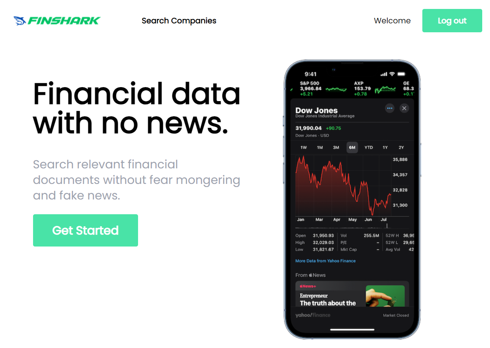

<!-- PROJECT LOGO -->
<br />
<div align="center">
  <a href="https://github.com/othneildrew/Best-README-Template">
    
  </a>

  <h3 align="center">Financial Service</h3>

  <p align="center">
    Search finance information easly!
    <br />
  </p>
</div>

<!-- ABOUT THE PROJECT -->

## Built With

### Frontend

- React
- TypeScript, HTML, CSS
- Tailwind

### Backend

- ASP.NET Web API
- C#
- Entity Framework Core
- JWT Authorization
- Migrations

### Database

- PostgreSQL
- Microsoft SQL Server - Optional

### Also

- Docker (Docker Compose)
- Financial Modeling Prep API

<!-- GETTING STARTED -->

## Installation

1. Get a free API Key at [https://site.financialmodelingprep.com](https://site.financialmodelingprep.com)
2. Clone the repo
   ```sh
   git clone https://github.com/your_username_/Project-Name.git
   ```
3. Enter your API key in `frontend/.env`
   ```js
   REACT_APP_API_KEY = ENTER_YOUR_API;
   ```
4. Enter your API key in `api/appsettings.json`
   ```js
   "FMPKey" : "ENTER_YOUR_API";
   ```
5. Install and run Docker
6. Go to FinancialWebService directory in shell and write the command
   ```sh
   docker-compose up
   ```

<!-- USAGE EXAMPLES -->

## Usage

1 Register a new account on the Sign in tab

2 Login in to your account

3 Search companies by ticker


4 Click Add button to add company to favorites

5 Click on the company name to view information about it


## Contact

Your Name - [@your_twitter](https://twitter.com/your_username) - email@example.com

Project Link: [https://github.com/your_username/repo_name](https://github.com/your_username/repo_name)

<!-- MARKDOWN LINKS & IMAGES -->
<!-- https://www.markdownguide.org/basic-syntax/#reference-style-links -->

[React-url]: https://reactjs.org/
